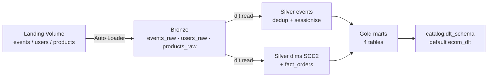

# DLT Pipeline — End-to-end

Operational and architectural reference for the **Delta Live Tables** pipeline (`ecom_dlt_pipeline`, exposed in the workspace as `bricksshop-dlt`). This is the path CD auto-runs on every push to `main`.

> Companion docs: [`architecture.md`](./architecture.md) (system shape), [`runbook.md`](./runbook.md) §1.2 (operations), [`data_quality.md`](./data_quality.md) §7 (expectation parity), [`ci_cd.md`](./ci_cd.md) §8.6–8.8 (deploy / target wiring).

Code: [`pipelines/dlt/schemas.py`](../pipelines/dlt/schemas.py), [`bronze.py`](../pipelines/dlt/bronze.py), [`silver.py`](../pipelines/dlt/silver.py), [`gold.py`](../pipelines/dlt/gold.py), [`databricks.yml`](../databricks.yml).

---

## 1 · What this pipeline is, and why it exists

A Delta Live Tables pipeline that re-implements the same Bronze → Silver → Gold logic as the Workflow `medallion` job, expressed declaratively as `@dlt.table` materialised views and streaming tables. It runs on **serverless DLT compute** (mandatory on Databricks Free Edition).

### Why two paths?

The Workflow `medallion` job is the **imperative** path — notebooks call into `src/`, which is unit-tested by `tests/`. The DLT pipeline is the **declarative** path — DLT owns checkpoints, lineage, expectation reporting, and table materialisation.

| Concern                    | Workflow `medallion`                       | DLT `ecom_dlt_pipeline`                                |
|----------------------------|--------------------------------------------|--------------------------------------------------------|
| Programming model          | Imperative PySpark, `MERGE`, `overwrite`   | Declarative `@dlt.table` materialised views            |
| Checkpoints                | Hand-managed under `_checkpoints/`         | Owned by the DLT runtime                               |
| Lineage                    | Implicit (notebook order)                  | Explicit DAG inferred from `dlt.read(...)`             |
| Quality reporting          | `Expectation` framework, final task        | `@dlt.expect` / `@dlt.expect_or_fail`, inline          |
| Compute                    | Reuses the shared cluster (Free Edition)   | Serverless DLT compute (Free Edition mandate)          |
| Test coverage              | Pure-Python tests under `tests/`            | None — DLT runtime is not importable outside Databricks |
| Auto-run by CD             | No — manual `bundle run`                   | ✅ on every push to `main`                              |
| Output schema              | `${var.bronze_schema}` / `silver_schema` / `gold_schema` (`ecom_bronze` / `ecom_silver` / `ecom_gold`) | `${var.dlt_schema}` (default `ecom_dlt`) |

The two paths share the **landing Volume** (Bronze input) but write to **different output schemas**, so they never contend on the same Delta tables. Either can be removed without affecting the other.

---

## 2 · End-to-end flow

```
   /Volumes/${catalog}/${bronze_schema}/${volume}/{events,users,products}/   ← shared landing
                              │
                              │  Auto Loader (cloudFiles)
                              ▼
   ┌───────────── BRONZE (streaming tables) ─────────────┐
   │ events_raw · users_raw · products_raw               │
   │   @dlt.expect("event_id_present", …) etc.           │
   └─────────────────────────┬───────────────────────────┘
                             │  dlt.read(...)
                             ▼
   ┌───────────── SILVER (materialised views) ───────────┐
   │ events            (dedup + sessionise; expects)     │
   │ dim_users_scd2    (SCD2 by attribute hash)          │
   │ dim_products_scd2 (SCD2 by attribute hash)          │
   │ fact_orders       (purchase rollup; expects)        │
   └─────────────────────────┬───────────────────────────┘
                             │  dlt.read(...)
                             ▼
   ┌───────────── GOLD (materialised views) ─────────────┐
   │ fact_daily_sales · fact_funnel ·                    │
   │ fact_abandoned_carts · dim_user_360                 │
   └─────────────────────────────────────────────────────┘
                             │
                             ▼
       Tables published to ${catalog}.${dlt_schema}
       (default: dev_main.ecom_dlt)
```

### 2.1 Source — landing Volume

Same Volume the Workflow reads. The DLT pipeline does **not** generate or own the data — the simulator (`notebooks/10_run_simulator.py`) or any production producer (Kafka sink, etc.) drops files into:

```
/Volumes/${catalog}/${bronze_schema}/${volume}/events/
/Volumes/${catalog}/${bronze_schema}/${volume}/users/
/Volumes/${catalog}/${bronze_schema}/${volume}/products/
```

The DLT pipeline reads `LANDING_BASE = /Volumes/<catalog>/<bronze_schema>/<volume>` (computed in `bronze.py` from `spark.conf` keys populated by `databricks.yml`).

### 2.2 Bronze — `pipelines/dlt/bronze.py`

Three streaming tables, one per source. Each uses Auto Loader (`cloudFiles`) with the pinned `StructType` from `schemas.py` (no `inferSchema`). Schema drift goes to `_rescued_data` — same contract as the Workflow path.

| Table          | Source dir              | Notes                                                  |
|----------------|-------------------------|--------------------------------------------------------|
| `events_raw`   | `landing/events/`       | Partitioned by `_ingest_date`; `delta.appendOnly=true` |
| `users_raw`    | `landing/users/`        | Snapshot capture (SCD2 happens in silver)              |
| `products_raw` | `landing/products/`     | Snapshot capture (SCD2 happens in silver)              |

Three metadata columns are added on ingest: `_ingest_ts` (current_timestamp), `_source_file` (`_metadata.file_path`), and on `events_raw` only, `_ingest_date` (partition column).

Bronze expectations are **`@dlt.expect`** (warn-only) — Bronze must remain source-faithful. A non-null violation here is reported in the event log without dropping the row. Hard rejection happens in Silver.

### 2.3 Silver — `pipelines/dlt/silver.py`

Four materialised views, declared with `@dlt.table` and `dlt.read(...)` from Bronze.

| Table              | Built from                | Logic                                                              |
|--------------------|---------------------------|--------------------------------------------------------------------|
| `events`           | `events_raw`              | Filter on `event_id`/`event_type`/`event_ts`; dedup by `row_number()` over `(event_id ORDER BY _ingest_ts DESC)`; sessionise via 30-min inactivity gap → `session_id_silver = <user_id\|anon>_<seq>`; partition by `event_date` |
| `dim_users_scd2`   | `users_raw`               | Hash tracked attrs (`email, country, city, marketing_opt_in, loyalty_tier`); detect boundaries; emit `valid_from / valid_to / is_current / version` |
| `dim_products_scd2`| `products_raw`            | Same SCD2 pattern; tracked attrs include `price, category, subcategory, brand, currency, active` |
| `fact_orders`      | `events` (purchases only) | Group by `order_id`; `collect_list` line items; recompute `subtotal / tax (8%) / shipping (free over $75 else $9.99) / total`; partition by `order_date` |

Silver expectations include `@dlt.expect_or_fail` for invariants (`event_id_not_null`, `valid_event_type`, `session_id_silver_present`, `purchase_has_order_id`, `order_total_positive`, `order_subtotal_consistent`, `order_has_items`) and `@dlt.expect` for soft signals (`non_negative_price`, `positive_quantity`, `order_total_matches`). Full parity table in [`data_quality.md`](./data_quality.md) §7.

> Sessionisation and SCD2 are inherently windowed (`Window.partitionBy(...).orderBy(...)`), so they cannot run as incremental streaming tables — they are batch materialisations re-evaluated on every pipeline update.

### 2.4 Gold — `pipelines/dlt/gold.py`

Four materialised views, fully rebuilt from Silver on every update.

| Table                  | Grain                       | Powers                              | Notable expectations                              |
|------------------------|-----------------------------|--------------------------------------|---------------------------------------------------|
| `fact_daily_sales`     | day × category × country    | Sales / GMV / AOV dashboards         | `gmv >= 0`; `units >= orders`                     |
| `fact_funnel`          | day                         | Conversion rates view→cart→purchase  | All rate columns in `[0, 1]`                      |
| `fact_abandoned_carts` | session                     | Email / ad remarketing campaigns     | `cart_value >= 0`                                 |
| `dim_user_360`         | user (current SCD2 only)    | RFM segmentation; ML feature base    | `segment IN ('prospect','active','lapsing','churned')` |

`dim_user_360` reads three Silver tables (`dim_users_scd2` filtered to `is_current = true`, `fact_orders`, `events`) and computes recency / orders / LTV / segment in a single materialised view.

### 2.5 Output — single target schema

Every table — bronze, silver, gold — is published under one schema: `${var.catalog}.${var.dlt_schema}` (default `dev_main.ecom_dlt`). Table names are byte-identical to the Workflow path:

```
dev_main.ecom_dlt.events_raw            dev_main.ecom_dlt.users_raw           dev_main.ecom_dlt.products_raw
dev_main.ecom_dlt.events                dev_main.ecom_dlt.dim_users_scd2      dev_main.ecom_dlt.dim_products_scd2
dev_main.ecom_dlt.fact_orders
dev_main.ecom_dlt.fact_daily_sales      dev_main.ecom_dlt.fact_funnel
dev_main.ecom_dlt.fact_abandoned_carts  dev_main.ecom_dlt.dim_user_360
```

A SQL template that targets `dev_main.ecom_silver.events` works against `dev_main.ecom_dlt.events` with one find-and-replace.

---

## 3 · Code structure

```
pipelines/dlt/
├── schemas.py       # Self-contained mirror of src/common/schemas.py
├── bronze.py        # Streaming tables — Auto Loader on the landing Volume
├── silver.py        # Dedup + sessionise + SCD2 + fact_orders
└── gold.py          # 4 marts (fact_daily_sales, funnel, abandoned, user_360)
```

| File         | Responsibility                                                                                                                |
|--------------|-------------------------------------------------------------------------------------------------------------------------------|
| `schemas.py` | Pinned `EVENT_SCHEMA`, `USER_SCHEMA`, `PRODUCT_SCHEMA`. **Lockstep mirror** of `src/common/schemas.py` — DLT runtime cannot import `src/`, so the schemas live alongside the pipeline. Any producer schema change must update both files. |
| `bronze.py`  | Three streaming tables (`events_raw`, `users_raw`, `products_raw`). Auto Loader options (`cloudFiles.format=json`, `inferColumnTypes=false`, `schemaEvolutionMode=rescue`); metadata columns; `@dlt.expect` (warn) on key fields. |
| `silver.py`  | `events` (dedup + sessionise), `dim_users_scd2`, `dim_products_scd2`, `fact_orders`. Hard expectations as `@dlt.expect_or_fail`; soft as `@dlt.expect`. Pulls `INACTIVITY_MINUTES` from pipeline configuration. |
| `gold.py`    | Four marts. Each is a single `@dlt.table` reading from `dlt.read("events")` / `dlt.read("fact_orders")` / `dlt.read("dim_users_scd2")`. Full rebuild on every update. |

### 3.1 Why self-contained (no `src/` imports)

The DLT runtime loads each `libraries: [{ file: ... }]` entry into a single Python namespace; sibling imports (`from schemas import EVENT_SCHEMA`) resolve directly. Touching `sys.path` to reach `src/` was tried earlier and was fragile across Free Edition workspace path changes; the lockstep mirror is the durable contract.

### 3.2 Configuration injection

`databricks.yml` declares a `configuration:` block on the pipeline resource. Each key shows up as `spark.conf.get("ecom.<key>")` inside the DLT modules:

```yaml
configuration:
  ecom.catalog:        ${var.catalog}
  ecom.bronze_schema:  ${var.bronze_schema}
  ecom.volume:         ${var.volume}
  ecom.inactivity_minutes: "30"
```

This keeps the DLT modules free of hard-coded catalog / schema names — promoting `dev` → `prod` is a target switch, no code change.

---

## 4 · Execution model

### 4.1 What a "pipeline update" is

A DLT update is one synchronous run of the pipeline. The DLT runtime:

1. Plans the DAG by inspecting `dlt.read(...)` / `dlt.read_stream(...)` calls.
2. Provisions serverless compute.
3. Materialises tables in dependency order — Bronze first, then Silver, then Gold.
4. Evaluates expectations as rows flow through. `@dlt.expect_or_fail` violations abort the update and roll back the offending table version; downstream tables in the same update are skipped.
5. Tears down compute on completion.

Each update writes a new Delta version per table; `DESCRIBE HISTORY` works as on any other Delta table. Updates can be triggered by `bundle run`, the workspace UI (**Pipelines → bricksshop-dlt → Start**), or any DLT scheduling mechanism.

### 4.2 How it differs from the Workflow `medallion` job

| Aspect              | Workflow `medallion`                              | DLT pipeline update                                  |
|---------------------|---------------------------------------------------|------------------------------------------------------|
| Unit of execution   | A run of a 7-task DAG (notebook tasks)           | A single pipeline update across all `@dlt.table`s    |
| Failure granularity | A failed task aborts the run; prior tasks remain | A failed table rolls back; downstream tables skip    |
| Idempotency         | `MERGE` on `event_id`; `overwrite` for marts     | Built-in: tables are rebuilt or appended by the runtime |
| Schedule            | Workflow cron in `databricks.yml` (PAUSED)       | `continuous: false` — manual / CD-driven updates      |
| Observability       | Workflow run page; cell stdout                    | DLT event log; per-expectation drop counters; lineage UI |

### 4.3 Serverless compute on Free Edition

`databricks.yml` declares the pipeline with **`serverless: true`**, **`development: true`**, **`continuous: false`** and **no cluster configuration**. Free Edition mandates serverless DLT — without `serverless: true` the deploy fails with `You must use serverless compute in this workspace`. Each update is finite and releases compute when it terminates; nothing runs between updates.

`development: true` keeps Auto Loader's "wait for new files" timeout short and lowers retry budgets, which is what you want for iterative dev. The `prod` target overrides `development: false` so production updates retry on transient errors and use full timeouts.

---

## 5 · Data quality

The DLT pipeline encodes the **same predicates with the same severities** as `notebooks/99_quality_checks.py`. Predicates live next to the table definitions in `silver.py` (mostly) and `gold.py`:

```python
@dlt.expect_or_fail("event_id_not_null",            "event_id IS NOT NULL")
@dlt.expect_or_fail("valid_event_type",             "event_type IN ('page_view','add_to_cart','purchase','abandon_cart')")
@dlt.expect_or_fail("session_id_silver_present",    "session_id_silver IS NOT NULL")
@dlt.expect_or_fail("purchase_has_order_id",        "event_type <> 'purchase' OR order_id IS NOT NULL")
@dlt.expect("non_negative_price",                   "price IS NULL OR price >= 0")
@dlt.expect("positive_quantity",                    "quantity IS NULL OR quantity > 0")
```

| Severity                   | Workflow framework                                           | DLT decorator                            |
|----------------------------|--------------------------------------------------------------|------------------------------------------|
| Hard invariant (run abort) | `Expectation(..., severity="fail")` + `enforce()`            | `@dlt.expect_or_fail(name, predicate)`   |
| Soft signal (count + log)  | `Expectation(..., severity="warn")` (logged, no abort)       | `@dlt.expect(name, predicate)`           |

Behavioural difference: the Workflow gate runs **after** Silver and Gold have already been written; a `fail` results in a `FAILED` run with stale Gold visible. DLT enforces inline — a violated `expect_or_fail` rolls back the offending table version and prevents downstream tables in the same update from materialising.

Full parity table in [`data_quality.md`](./data_quality.md) §7. When updating predicates, change **both** files in the same PR; CI does not (yet) cross-check them.

---

## 6 · Deployment

### 6.1 Bundle wiring

The pipeline is declared once at the bundle root in [`databricks.yml`](../databricks.yml):

```yaml
resources:
  pipelines:
    ecom_dlt_pipeline:
      name: ecom-dlt
      catalog: ${var.catalog}
      target:  ${var.dlt_schema}
      libraries:
        - file: { path: ./pipelines/dlt/schemas.py }   # must load before bronze
        - file: { path: ./pipelines/dlt/bronze.py }
        - file: { path: ./pipelines/dlt/silver.py }
        - file: { path: ./pipelines/dlt/gold.py }
      configuration:
        ecom.catalog:            ${var.catalog}
        ecom.bronze_schema:      ${var.bronze_schema}
        ecom.volume:             ${var.volume}
        ecom.inactivity_minutes: "30"
      serverless:  true
      development: true
      continuous:  false
```

`schemas.py` must appear first in `libraries` — DLT loads files in declaration order, and `bronze.py` imports from it.

### 6.2 Targets

| Target          | What it deploys                                  | When to use                                              |
|-----------------|--------------------------------------------------|----------------------------------------------------------|
| `dev` (default) | DLT pipeline + Workflow `medallion` job           | Standard dev work — both paths available; CD auto-runs only DLT |
| `dev_dlt_only`  | DLT pipeline only — Workflow job left untouched   | Iterating on `pipelines/dlt/*` without touching the job   |
| `prod`          | DLT pipeline (`development: false`) + medallion   | Tag-gated production promotion (planned — see [`ci_cd.md`](./ci_cd.md) §8.4) |

### 6.3 Commands

```bash
# Validate (offline; no workspace changes)
databricks bundle validate --target dev

# Full deploy — uploads notebooks, the DLT modules, the medallion job def, and the pipeline def
databricks bundle deploy --target dev

# Run the DLT pipeline synchronously
databricks bundle run --target dev ecom_dlt_pipeline

# Iterate on DLT only — leaves the Workflow job untouched
databricks bundle deploy --target dev_dlt_only
databricks bundle run    --target dev_dlt_only ecom_dlt_pipeline
```

### 6.4 What CD does

`.github/workflows/cd.yml` runs on every push to `main` that touches `src/**`, `notebooks/**`, `pipelines/**`, `databricks.yml`, `conf/**`, or `.github/workflows/**`:

1. `databricks bundle validate --target dev`
2. `databricks bundle deploy --target dev`
3. `databricks bundle run --target dev ecom_dlt_pipeline`
4. Post-run sanity: `SELECT * LIMIT 10` from `dev_main.ecom_dlt.fact_daily_sales` (warning if no SQL warehouse is available)

Pull requests run only step 1. The Workflow `medallion` job is deployed by step 2 but **not** auto-run by CD — trigger it manually with `databricks bundle run --target dev medallion` when you want a notebook-DAG run.

---

## 7 · Flow diagram



---

## 8 · Where to go next

- Operations / debugging → [`runbook.md`](./runbook.md) §1.2
- Expectation parity → [`data_quality.md`](./data_quality.md) §7
- Targets / partial deploys / CD wiring → [`ci_cd.md`](./ci_cd.md) §8.6–8.8
- Source schemas (lockstep mirror) → [`data_model.md`](./data_model.md)
- Big-picture architecture → [`architecture.md`](./architecture.md) §7
